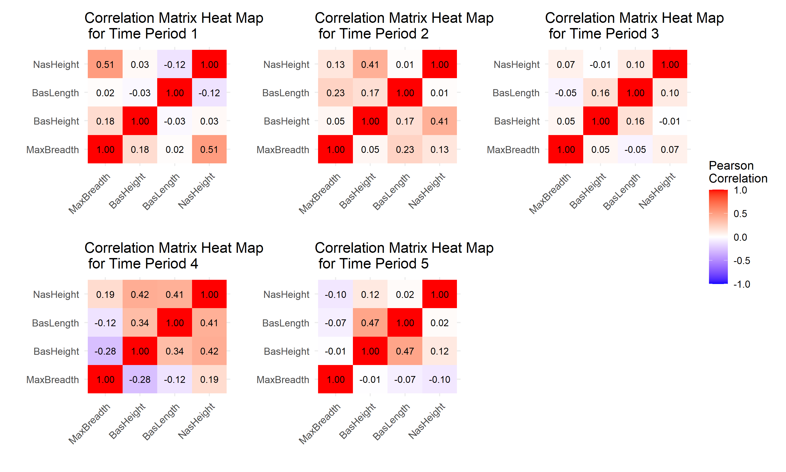

__________________________________________________________________________________________________________________
```{r setup, include=FALSE}
knitr::opts_chunk$set(warning=FALSE,
                      message = FALSE,
                      echo = TRUE,
                      fig.width = 5,
                      fig.height = 5,
                      fig.align = "center")
```


```{r, echo = FALSE, eval = FALSE, message = FALSE}
rm(list = ls())
#setwd("C:/Users/mjmaf/OneDrive/Documents/Hons Multivariate 2024/Assessment1")

# Load the necessary library
library(dplyr)
library(reshape2)
library(ggplot2)
library(patchwork)
library(tidyr)

# Read the dataset
data <- read.csv("CA1.csv", header = TRUE)
str(data)
```


\section{Question 1}
\subsection{Sample Mean Vectors}

The mean vector is defined as:
$$
\bar{x}_{j} = \frac{1}{n}\sum_{j}x_{ij} 
$$
Therefore the mean vector for each of the 5 time periods are:

```{r, echo = FALSE, eval = FALSE, message = FALSE}
#Question 1
# Compute the sample mean vectors for each time period
mean_vectors <- data %>%
  group_by(TimePeriod) %>%
  summarise(
    MaxBreadth = mean(MaxBreadth, na.rm = TRUE),
    BasHeight = mean(BasHeight, na.rm = TRUE),
    BasLength = mean(BasLength, na.rm = TRUE),
    NasHeight = mean(NasHeight, na.rm = TRUE)
  )

mean_vectors
```
\begin{table}[!h]
\begin{center}
\caption{Sample mean vectors for each of the five time periods}
\vspace{0.5cm}
\begin{tabular}{|c|c|c|c|c|}
\hline
\textbf{TimePeriod} & \textbf{MaxBreath} & \textbf{BasHeight} & \textbf{BasLength} & \textbf{NasHeight} \\
\hline
\textbf{1} & 131.367	& 133.600 & 99.167 & 50.533 \\
\textbf{2} & 132.367	& 132.700 & 99.067	& 50.233 \\
\textbf{3} & 134.467	& 133.800 & 96.033 & 50.567 \\
\textbf{4} & 135.500	& 132.300 & 94.533	& 51.967 \\  
\textbf{5} & 136.167	& 130.333 & 93.500 & 51.367 \\  
\hline
\end{tabular}
\end{center}
\end{table}


\newpage
\section{Question 2}
\subsection{Heat map of the correlation matrix}
```{r, echo = FALSE, eval = FALSE, message = FALSE}
#Qtn 2 function
# Function to generate a heat map for a given time period
generate_heat_map <- function(time_period) {
  filtered_data <- data[data$TimePeriod == time_period,]
  cor_matrix <- cor(filtered_data[,1:4]) # Assuming the first four columns are the variables

  # Melt the correlation matrix for ggplot
  melted_cor_matrix <- melt(cor_matrix)

  # Plot
  ggplot(melted_cor_matrix, aes(x = Var1, y = Var2, fill = value)) +
    geom_tile() +
    geom_text(aes(label = sprintf("%.2f", value)), color = "black", size = 3) +
    scale_fill_gradient2(low = "blue", high = "red", mid = "white", 
                         midpoint = 0, limit = c(-1,1), space = "Lab", 
                         name="Pearson\nCorrelation") +
    theme_minimal() +
    theme(axis.text.x = element_text(angle = 45, vjust = 1, size = 9, hjust = 1),
          axis.text.y = element_text(size = 9),
          plot.title = element_text((size = 14))) +
    labs(x = '', y = '', title = paste("Correlation Matrix Heat Map \n for Time Period", time_period))
}

```


```{r, echo = FALSE, eval = FALSE, message = FALSE}
#Q2 cntd
# Generate heat map for time periods
time_periods <- unique(data$TimePeriod)
plot_list <- list()

for (time_period in time_periods) {
  plot_list[[time_period]] <- generate_heat_map(time_period)
}

# Combine the plots. Adjust the layout with `plot_layout()`
combined_plot <- wrap_plots(plot_list, ncol = 3) + 
  plot_layout(guides = 'collect')

#save plots
ggsave("correlation_heatmaps.png", plot = combined_plot, width = 10, height = 6, units = "in")
```

{width="100%"}
\newpage
\begin{itemize}
  \item Over the 5 time periods, The correlation between NasHeight and MaxBreath decreases from an initial strongly positive correlation(0.51) to a very weak negative correlation(-0.1).
  \item From time period 1 to time period 5, The correlation between BasLength and BasHeight increases from a very weak negative correlation(-0.03) to a strong positive correlation(0.47)
  \item There is no pattern observed over the time periods between BasHeight and NasHeight
  \item Between time period 1 and time period 4, the correlation between NasHieght and BasLength increases from a weak negative correlation(-0.12) to a strong positive correlation(0.41), however the correlation weakens in Period 5.
  \item From time period 2 to time period 5, the correlation between BasLength and MaxBreath, decreases from a slightly weak positive correlation(0.23) to a weak negative correlation(-0.07)
  \item From time period 1 to time period 4, the correlation between BasHeight and MaxBreath decreases from a weak positive correlation(0.18) to a weak negative correlation(-0.28). And there is almost no correlation in Period 5.
\end{itemize}


\section{Question 3}
\subsection{Deviation Vectors}
```{r, echo = FALSE, eval = FALSE, message = FALSE}
# Q3

# Filter data for period 1
data_period_1 <- data[data$TimePeriod == 1,]

# Extract vectors for X1 and X3
x1 <- data_period_1$MaxBreadth
x3 <- data_period_1$BasLength

# Compute deviation vectors from their means
x1_dev <- x1 - mean(x1)
x3_dev <- x3 - mean(x3)

# Calculate the cosine of the angle using the dot product
cos_angle <- sum(x1_dev * x3_dev) / (sqrt(sum(x1_dev^2)) * sqrt(sum(x3_dev^2)))
cos_angle
# Calculate the angle in radians
angle_radians <- acos(cos_angle)

# Convert the angle to degrees
angle_degrees <- angle_radians * (180 / pi)

angle_degrees
```
The deviation vector defines the deviation of the observed values from the variable means, as shown below:
$$
\underline{d}_{i} = \underline{x} - \bar{x}\underline{1}
$$
In this case, we have to find the angle between the deviation vectors for X1{$\underline{d}_{1}$} and X3$\underline{d}_{3}$ in period 1.

We know that to find the angle:
$$
cos(\theta) = \frac{\underline{d}_{1}^{T}\underline{d}_{3}}{||\underline{d}_{1}||.||\underline{d}_{3}||}
$$
The distance is calculated as:
$$
||\underline{d}_{i}|| =  \sqrt{\underline{d}_{i}^{T}\underline{d}_{i}}
$$
The distance for deviation vector 1({$\underline{d}_{1}$}) is 27.622, while The distance for deviation vector 3({$\underline{d}_{3}$}) is 31.689.

Therefore with this information we find that the $cos(\theta)$ value is equal to 0.0150425.

The cosine of the angle between two deviation vectors is equal to the correlation coefficient between the corresponding vectors:
$$
cos(\theta) = \frac{s_{13}}{\sqrt{s_{11}}.\sqrt{s_{33}}}
$$
From the information above, the angle between the two deviation vectors is calculated as: 1.555753 radians or 89.1381 degrees.


We define the following deviation vectors for period 1 across the first two observations
\begin{align}
\begin{bmatrix} 
  3 & -3  \\
  3.5 & -3.5 \\
  -1.5 & 1.5 \\
  0.5 & -0.5
\end{bmatrix}
\end{align}

\section{Question 4}
\subsection{Sample Mean and Covariance}
```{r, echo = FALSE, eval = FALSE, message = FALSE}
#Qtn 4
b <- c(-1,0,0,3)
means_matrix <- as.matrix(mean_vectors[, 2:ncol(mean_vectors)])
y_means <- means_matrix%*%b
#means for y1 to y5
y_means

#now calculating the covariance matrix
data = data %>% mutate(Y = 3*NasHeight - MaxBreadth) #the y value for each data data point
y_data <- data %>% select(TimePeriod, Y)

#create an index to match data points ie 30 data points for 5 periods
index <- rep(seq(1,30), times = 5)
y_data$index <- index
y_data_wide <- pivot_wider(y_data, names_from = TimePeriod, values_from = Y) #pivot data to use cov function

head(y_data_wide)
y_data_wide <- y_data_wide %>% select(-index) #remove the index from cov calculation
y_covariances <- cov(y_data_wide)
y_covariances
```


Researchers are interested in the quantity $Y_{i} = 3X_{4} − X_{1}$ for time periods i = 1, . . . , 5.

To calculate the sample mean using the information above, we use the below formula:
$$
E(b^{T}X) = b^{T}\mu
$$
We therefore define the appropriate b vector to be:
\begin{align}
\mathbf{b} = \begin{bmatrix} -1\\0\\0\\3 \end{bmatrix}
\end{align}

Therefore using the vector above with the mean matrix from question 1, we have the that sample mean is calculated as below:
\begin{align}
\mathbf{E(b^{T}X)} = \begin{bmatrix} 20.233\\18.333\\17.233\\20.400\\17.9333 \end{bmatrix}
\end{align}

There covariance matrix of $Y = [Y_{1}\quad Y_{2}\quad Y_{3}\quad Y_{4}\quad Y_{5}]^{T}$ is given below:
\begin{align}
\begin{bmatrix} 
  51.564 & 1.402 & 23.323 & -7.924  & 0.223 \\
  1.402 & 90.712 & -6.080 & 29.862 & 2.885 \\
  23.323 & -6.080460 & 120.11609 & -10.131034 & -33.4321839 \\
  -7.924 & 29.862 & -10.131 & 74.731  & 14.648 \\
   0.223 & 2.885 & -33.432  & 14.648 & 165.029
\end{bmatrix}
\end{align}


\newpage
\section{Appendix}
```{r, ref.label=knitr::all_labels(),echo=TRUE,eval=FALSE}
```
